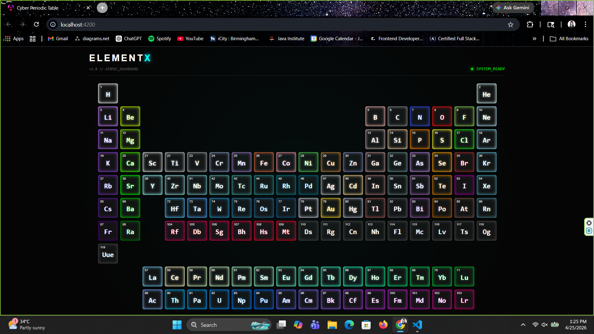
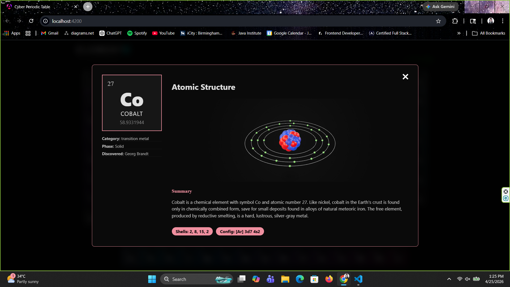

# ElementX // Atomic Dashboard


**ElementX** is a high-performance, interactive periodic table dashboard built with **Angular 18**. It provides a comprehensive visual and data-driven exploration of the chemical elements, combining modern web aesthetics with scientific accuracy. The application features a dynamic grid layout, detailed element analysis, and 3D atomic visualizations.

## 🚀 Key Features

* **Interactive Periodic Grid:** A fully responsive 18-column grid layout with color-coded categories and dynamic hover states.
* **3D Bohr Model Visualization:** Integration of `<model-viewer>` for real-time 3D interaction with atomic structures.
* **Atomic Deep-Dive:** Comprehensive modal views for each element, showcasing atomic mass, electron configurations, and discovery history.
* **Advanced Search & Filter:** Quick-access filtering to locate elements by name, symbol, or specific chemical categories.
* **Cyber-Terminal UI:** A dark-themed, "glassmorphism" aesthetic designed for high-end developer portfolios and educational dashboards.
* **Responsive Architecture:** Optimized for various viewport sizes using CSS Grid and Flexbox.

## 🛠️ Tech Stack

* **Framework:** Angular 18 (Standalone Components)
* **Language:** TypeScript
* **Styling:** CSS3 (Custom Properties & Cyber-Aesthetic Animations)
* **3D Rendering:** Google Model-Viewer
* **Data Handling:** RxJS & HttpClient for localized JSON stream management.

## 📊 Data Source & Credits

The core scientific data powering this dashboard is sourced from the **Periodic-Table-JSON** project by **Bowserinator**. This comprehensive dataset includes detailed element properties, Bohr model links, and summaries.

* **Data Source:** [Bowserinator/Periodic-Table-JSON](https://github.com/Bowserinator/Periodic-Table-JSON)

## ⚙️ Development Setup

### Prerequisites
* Node.js (LTS version)
* Angular CLI (`npm install -g @angular/cli`)

### Installation

1.  **Clone the Repository**
    ```bash
    git clone https://github.com/your-username/elementx.git
    cd elementx
    ```

2.  **Install Dependencies**
    ```bash
    npm install
    ```

3.  **Local Development Server**
    ```bash
    ng serve
    ```
    Navigate to `http://localhost:4200/`. The app will automatically reload if you change any of the source files.

## 📁 Project Structure

```text
src/
├── app/
│   ├── components/
│   │   └── periodic-table/         # Main Dashboard Logic
│   │       ├── periodic-table.component.ts
│   │       ├── periodic-table.component.html
│   │       └── periodic-table.component.css
├── assets/
│   └── periodic-data.json         # Sourced from Bowserinator
└── config.ts                      # App Configurations
```

## 🧠 Core Logic Overview

* **Category Coloring:** The application dynamically maps CPK hex colors to element cards, ensuring visual consistency with standard chemical modeling.
* **Memory Efficiency:** Built as a pure frontend solution, it utilizes Angular's `HttpClient` to efficiently parse and render large JSON datasets without the need for a dedicated backend.
* **Viewport Management:** Uses a fixed `70vw` grid width to maintain a "dashboard" feel, preventing layout overflow on high-resolution displays.

---

## 📸 Interface Preview

### Dashboard

*The main interactive interface featuring the high-tech periodic grid and real-time system status.*

### Element Modal

*Detailed element analysis view featuring the interactive 3D Bohr model and chemical properties.*

---

## 📃 License

This project is provided for educational and personal use. For commercial use, please contact the author.

---

## 👨‍💻 Author

Created by **Thedara Sasindi**  
*Ungergraduate Full‑stack Software Engineering*  
GitHub: <https://github.com/sasindi22>  
Email: thedarasasindi@gmail.com
